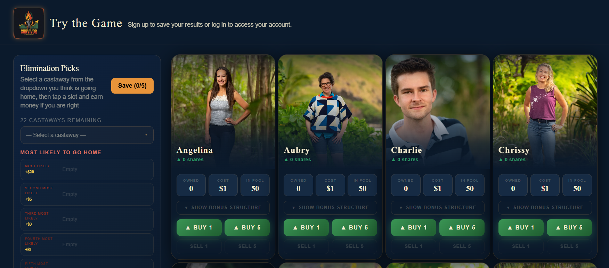

# Survivor Stock Exchange

## Table of Contents
1. [Introduction](#introduction)
2. [Features](#features)
3. [Project Structure](#project-structure)

## Introduction
As a Survivor fan, I love to make preseason drafts and predictions. The thrill of listening to the interviews and trying to tease out what is going to happen is always a great time. However, right when the episode starts you quickly realize that all your assumptions are wrong. I wanted to make a game that you could play as the season is going. The more knowledge that you recieve as the episodes go on, the more you can make educated predictions. This is a stock market interactive game where you can buy and sell all the way up to the finale. I hope this will be a fun game for other enthusiasts to play with their friends and add to the fun of watching the show.

In this game, each player begins with $100 to invest in Survivor contestants. You can choose to put all your stock in one contestant or spread your investments across multiple players. Each week, as contestants are eliminated from the show, any stock you’ve invested in them will be lost. Survivor contestants with higher investments will see their stock prices rise, making them more expensive to buy—but also more valuable. Bonuses are given each week for survivors who win challenges, rewards, find and play idols and advantages, and cast their votes correctly. You can choose long term strategies and try to predict the ultimate winner, or short term strategies and try to pick who you think is going to win the next challenge. You can also choose who you think is going home each week and receive more bonus money if you choose correctly.

This is a game made to be played either solo or in groups. Solo players can make their predictions and compare it to the maximum possible score. Groups compete with each other. Groups can be as small as two people or as large as you want. The larger groups have more available stock in each survivor contestant and the prices are more inflexible. It is your job to find the right strategy to outwit and outplay your friends. 

Making this game was my first time building a full stack web application. I saw this as a great oppurtunity to grow my expertise in this area. I found myself thouroughly enjoying the process of building the game and enjoyed it much more than the game itself. I will keep making updates and iterations to the game to try to keep it as fun and modern as possible. 

[Try the game yourself](https://survivorstockexchange.com)



## Features

- **Dynamic pricing algorithm** — share prices update based on ownership ratios and the number of active survivors using a supply/demand curve
- **Real-time episode events** — idol discoveries, correct/incorrect plays, individual and team challenge results, and vote outcomes all adjust stock values live during airings
- **Group multiplayer** — create or join groups with shared contestant pools; group budgets and share caps scale with member count
- **Tiered pricing in group mode** — a 5-tier system ($1–$5/share) divides the pool into 20% bands, incentivizing diversification over stacking fan favorites
- **Peer-to-peer trading** — players can offer shares or money to other group members, with full validation and trade history
- **Elimination predictions** — players predict elimination order before the episode; correct calls earn a $20 bonus per survivor
- **Leaderboard snapshots** — net worth rankings recorded per episode for historical performance tracking
- **Admin panel** — full season management including stock price adjustments, event logging, and episode configuration
- **Guest access** — try the game without registering

## Project Structure 
```text 
survivor_game/
├── server/
│   ├── controllers/       # Business logic (auth, trades, episodes, admin, leaderboard)
│   ├── models/            # Mongoose schemas (users, survivors, groups, trades, episodes)
│   ├── routes/            # API route definitions
│   ├── jobs/              # Scheduled tasks (episode status, price recording, leaderboard)
│   └── authMiddleware/    # JWT verification
│
└── client/
    ├── src/
    ├── pages/             # Dashboard, Leaderboard, Admin, Auth flows, Group management
    ├── components/        # Live event notifications, trade modals, stock charts
    ├── context/           # Global user state
    └── hooks/             # Guest user hook
```
## Tech Stack
**Frontend:** 
- React 18
- Vite
- Tailwind CSS
- React Router DOM
- Axios
- React Hot Toast

**Backend**
- Express
- Mongoose / MongoDB
- jsonwebtoken
- bcyrptjs
- Resend
- Luxon
- cookie-parser
- cors


